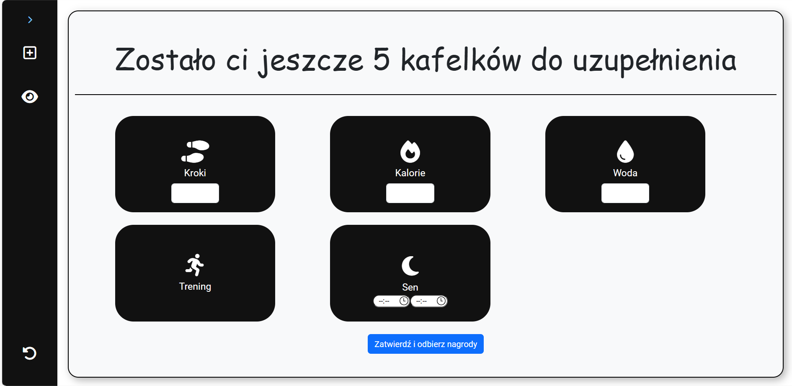
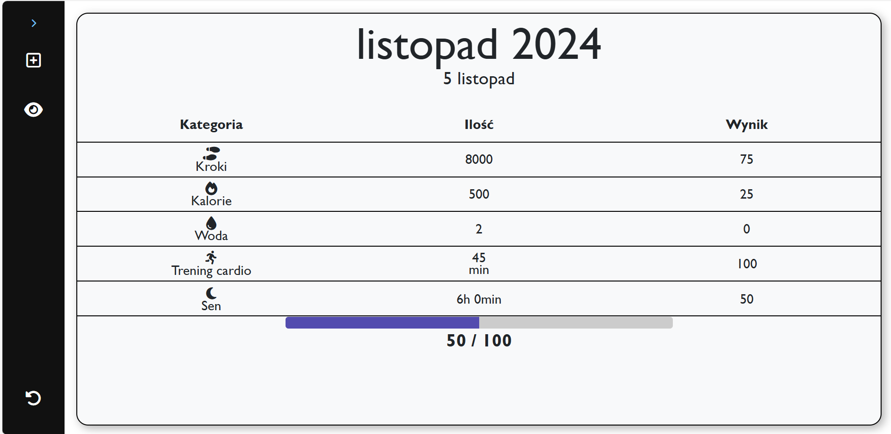
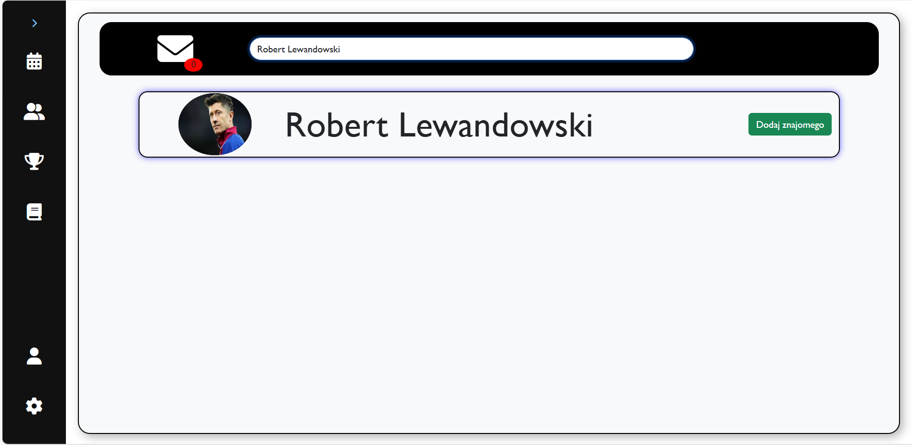
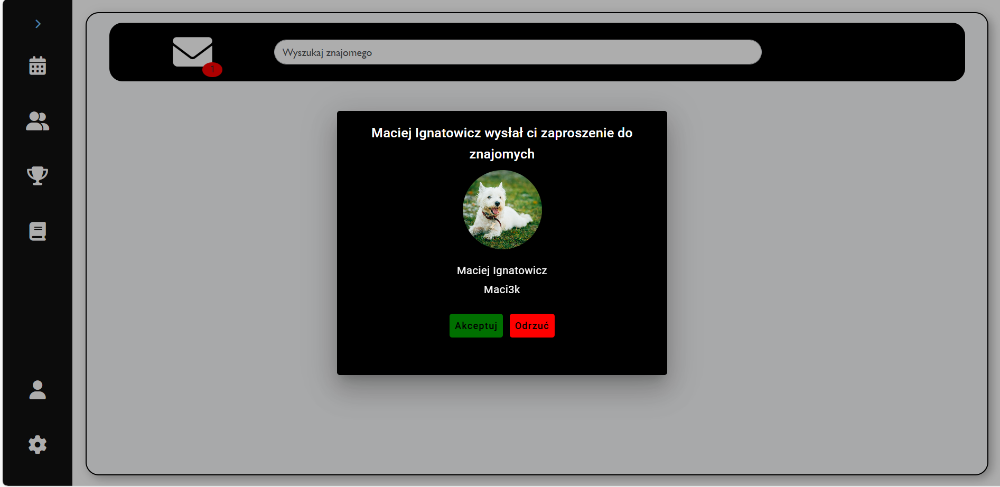

# Activity Tracker
Web application for tracking physical activity and promoting healthy habits

## Installation
To run the project locally follow these steps
## Prerequisites
Make sure you have installed
- [Node.js] (with npm packet manager, to run Angular application) https://nodejs.org/en
- [.NET SDK] (to run ASP .NET Core Web Api) https://dotnet.microsoft.com/en-us/download/visual-studio-sdks
- [SQL Server] (local data base) https://www.microsoft.com/pl-pl/sql-server/sql-server-downloads
- [SQL Server Management Studio] https://learn.microsoft.com/en-us/sql/ssms/download-sql-server-management-studio-ssms?view=sql-server-ver16

## Launching ASP .NET Web API
ASP.NET Core automatically generates an SSL certificate for local HTTPS connections, but you must trust it for the browser to accept it. Open terminal and use following command if needed:
```
dotnet dev-certs https --trust
```
After executing this command, the system may ask you to confirm the installation of the certificate. Confirm the system messages and restart the browser.
Web Api should be working on the following address:
```
https://localhost:7217/swagger/index.html
```

## Lauching Angular application
Make sure to have node.js and npm installed. You can check using these commands
```
node -v
npm -v
```
Install Angular CLI globally:
```
npm install -g @angular/cli
ng version
```
If you encounter errors with dependencies, use this command:
```
npm install --legacy-peer-deps
```
Run the Angular application:
```
ng serve -o
```

## Local database
In SQL Management Studio create new database, you can name it as shown or make your own by changing connection string in appsettings.json file in .net project
```
ActivityTrackerDB
```
To create database structure open .net project and use this command in NuGet terminal
```
UPDATE-DATABASE
```

## Overview
Below you can find some of the main functionalities already implemented in the application

## Registration and login
After completing the register form, verification email is sent. When done, click the verification link and you are ready to log in into your account


## Saving data and receiving feedback
You can save your everyday's data in the fields provided by application. Algorithm based on current science data will analyze them in terms of your personal informations such as gender, age, weight, height or athleticism, giving you achieved scores. Scores are calculated using default rules inside the algorithm or in relation to user's personal goals.




## Friends system 


